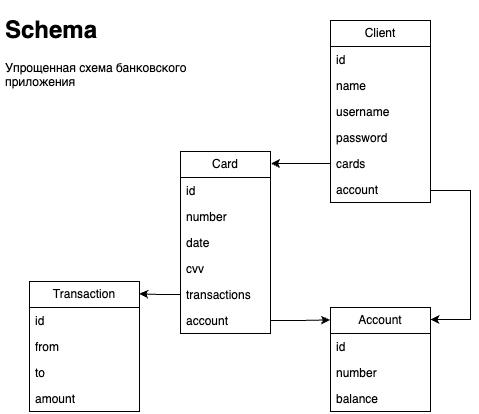
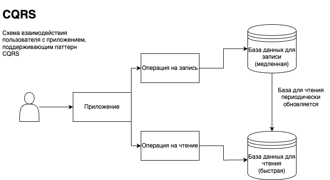
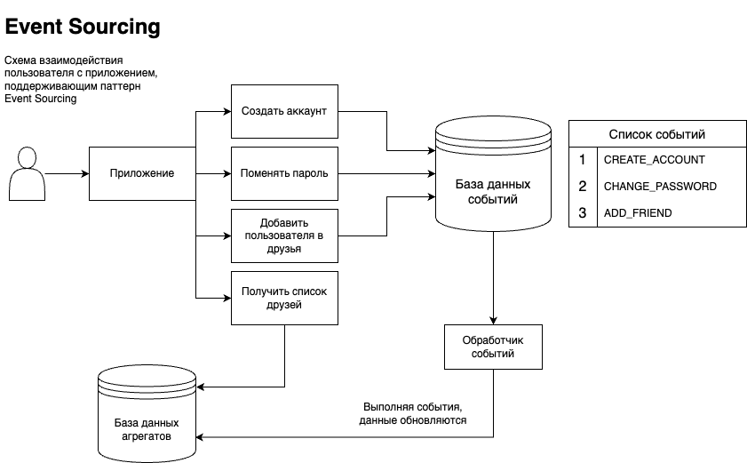
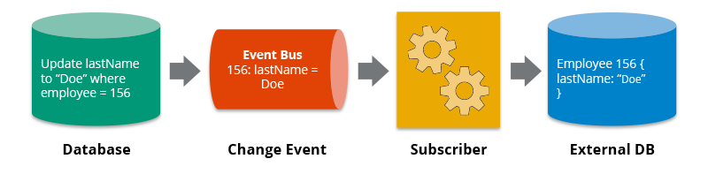

# CQRS and Event-Sourcing Banking App

Banking app example for **CQRS and Event-Sourcing pattern**.

This repository contains project
from [YouTube course](https://www.youtube.com/playlist?list=PL3Ur78l82EFD_M2te726IZ63rwBlY96M-).

You can find theory and explanation
in [this document](https://docs.google.com/document/d/1-TTxft3nS5C11puQ1LMLj3ZEtY4sOhp7WEEMkltnwds/edit).

## Application schema

## CQRS and Event-Sourcing

## Change Data Capture

## Usage

To start an application you need to pass variables to `.env` file. Look
at `.env.example` file with some predefined environments.

All services are running in docker containers. To start the application
you need to run `docker-compose up -d` command.

Application is running on port `8080`.

You can access endpoints and make requests to the application.

## How to contribute

If you found a bug or want to improve the application, feel free to create
an [issue](https://github.com/springbootcourses/cqrs-banking-app/issues).